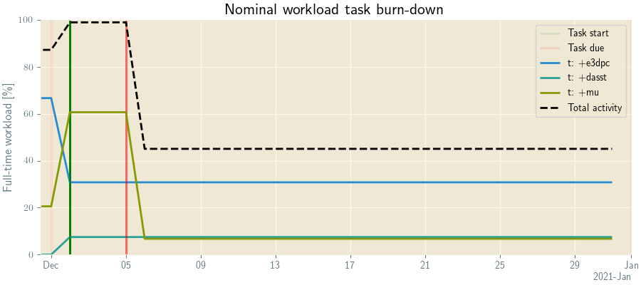
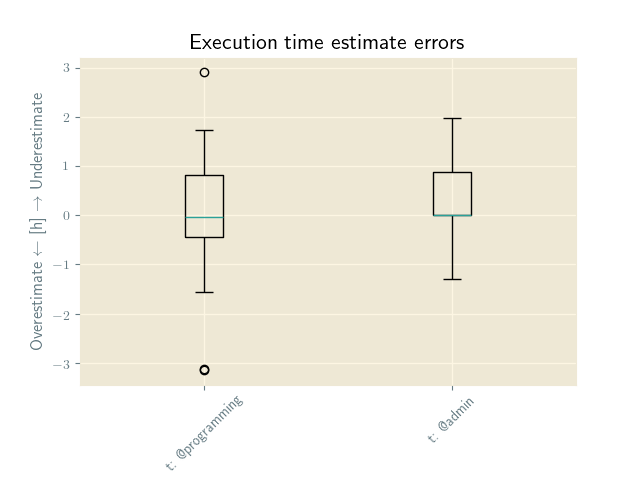
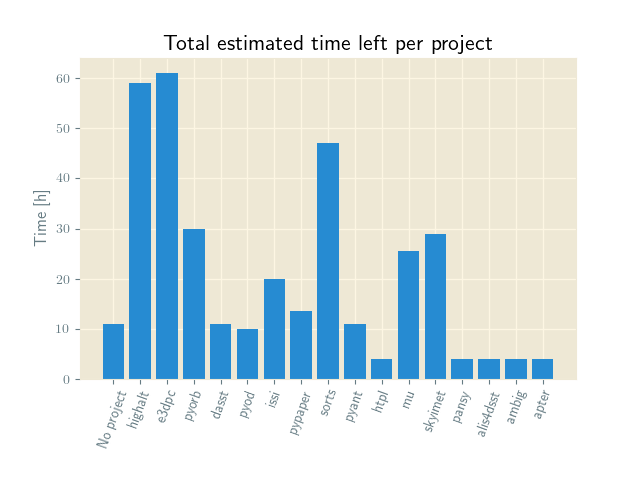

# apter

`apter` is a complementary analysis tool to the todotxt handler `pter`. If certain tags are consequently used in tasks several statistics and distributions can be calculated using `apter` such as:

* Estimated time left per project
* Estimated workload for completing all tasks in `pter` search(es)
* Task estimation accuracy
* Task delay (usage of the `t:` tag) or task completion time (`completed` before or after `due:` tag) distributions

And much more...

## Installation


```bash
    pip install pter_analysis
```

## Examples

Below are a series of examples of the usage of `apter`. The main application is performance review and project planning. However, how to do performance review and project planning is not covered in this README, only examples of usage that can help in those activities.

### Burndown chart

Generated using `apter burndown --end 2021-01-01 --adaptive -- "t: +e3dpc" "t: +dasst" "t: +mu"`. It shows the planned work percentage, using 6h work days (this is more realistic for actually completing tasks in a day since, e.g. meetings and reading emails are not tasks), for three different projects. It uses the entered `estimate`, `due` and `t` (taking `spent` tag into account) tags to calculate how much work needs to be done when. The `--adaptive` tag enables a algorithm that tries to shuffle around the start-time of tasks to keep the working activity below 100 percent.




### Estimation accuracy

Generated using `apter accuracy -- "t: @programming" "t: @admin"`. It shows the discrepancy between the `estimate` and `spent`. Here two different contexts are compared, showing that the estimation for programming tasks is zero centered while there is a clear bias to underestimate the time to complete administrative tasks.




### Time left

Generated using `apter distribution projects "t:"`. It shows the estimated time left for each project using the `estimate` tag.




### Generating completion list

Generated using `apter done --start 2020-11-09 --end 2020-11-10 --out rst -- "t:"`

```
2020-11-09
==========

- @programming +mu run validate event search and analysis on the test data set estimate:4h due:2020-11-05 spent:4h12m
- @programming +mu generalize "custom velocity" in pipeline estimate:2h due:2020-11-06 spent:3h4m
- @programming +apter account for spent tag in burndown due:2020-11-05 estimate:1h spent:32m


2020-11-10
==========

- @admin +course read papers for next physics seminar estimate:3h due:2020-11-11 spent:4h59m
- @admin +course prepare presentation for next physics seminar estimate:8h due:2020-11-11 spent:6h42m
```


## Tags used

The analysis is based on the usage of these tags:

* `due:` The due date of the task, see `pter` docs for relative dates.
* `estimate:` The estimated time needed to complete task in `hm` format, e.g. `2h30m`, see `pter` docs.
* `spent:` The actual time spent on the task, see `pter` docs on task tracking.


To facilitate usage of these tags, its recommended that highligts are set for them, in the terminal-version of `pter` this can be done trough the configuration files `[Highlight]` section. An example on ubuntu-16 terminal colors are:


```
    [Highlight]
    due = 33
    estimate = 207
    spent = 118
    t = 45
```


## Configuration


`apter` searches for a configuration file by default in a `pter_analysis` folder in the system default configuration folder, usually `~/.config`. The configuration file is named `pter_analysis.conf`.

Below is an example configuration file:


```
    [General]
    work-day-length = 6h
    work-week-length = 5d
    todotxt-file = /path/to/my/tasklist.todotxt
    matplotlib-style = Solarize_Light2
    usetex = True
    search-case-sensitive = True
```

Each function call to `apter` can also include a custom configuration file using the `--config [path]` option.

Most of the above options are self explanatory. The `usetex` options enables latex formating of matplotlib if `True` and a list of standard `matplotlib-style`'s can be found on the matplotlib docs <https://matplotlib.org/3.1.1/gallery/style_sheets/style_sheets_reference.html>. A path to a custom style can also be supplied here.